<div align="center">


<br/>

[github](https://github.com/Abhinay-code-max) &nbsp;·&nbsp;
[leetcode](https://leetcode.com/u/Abhinay-code-max) &nbsp;·&nbsp;
[linkedin](https://www.linkedin.com/in/abhinay-kandrika-5239a442a/) &nbsp;·&nbsp;
[instagram](https://www.instagram.com/) &nbsp;·&nbsp;
[email](mailto:abhinay2207@gmail.com)

<br/><br/>



</div>


<div align="center">


</div>


> Full-stack developer & AI systems engineer.<br>
> Transforming complex problems into sharp, high-performance software.

I build fast, test against real workloads, and focus on practical engineering.<br>
Currently working on autonomous AI assistants, interactive web platforms, and<br>
distributed backend architectures.


```Plain Text
┌─ CORE LANGUAGES ────────────────────────────────────────────────────────┐
│  Python · JavaScript · TypeScript · HTML5 · CSS3 · SQL                  │
├─ AI & BACKEND ──────────────────────────────────────────────────────────┤
│  FastAPI · Node.js · REST APIs · Docker · Linux · WebSockets            │
├─ FRONTEND & INTERACTIVE ────────────────────────────────────────────────┤
│  React.js · Three.js · HTML5 Canvas · Tailwind CSS · Modern Web APIs   │
├─ TOOLS & PLATFORMS ─────────────────────────────────────────────────────┤
│  Git · GitHub Actions · Postman · VS Code · Linux Shell                 │
└─────────────────────────────────────────────────────────────────────────┘
```


**[JARVIS-FOR-WEBISTE](https://github.com/Abhinay-code-max/JARVIS-FOR-WEBISTE)** &nbsp;·&nbsp; <samp>python, ai</samp><br>
Intelligent voice and text assistant for web environments and task automation.

**[eyv-website-2](https://github.com/Abhinay-code-max/eyv-website-2)** &nbsp;·&nbsp; <samp>javascript, react</samp><br>
Modern responsive web platform and frontend architecture.

**[backend-assignment](https://github.com/Abhinay-code-max/backend-assignment)** &nbsp;·&nbsp; <samp>python, backend</samp><br>
Scalable API architecture, data validation, and backend microservices.

**[pac-man-game-](https://github.com/Abhinay-code-max/pac-man-game-)** &nbsp;·&nbsp; <samp>javascript, canvas</samp><br>
Interactive retro arcade game built with vanilla web technologies.


<div align="center">




</div>


<div align="center">


</div>


Every graphic here is generated, not embedded from anyone else's server.<br>
The stat graphics, activity feed, terminal HUD, LeetCode card, and section headings<br>
are drawn directly by [a scheduled action](.github/workflows/stats.yml)<br>
straight from the GitHub GraphQL & REST APIs and LeetCode GraphQL API, once a day.

They animate with SMIL inside the SVG, because GitHub strips scripts from<br>
READMEs — and since nothing loads from a third party, nothing here can<br>
rate-limit or go dark. The headings are SVGs for the same reason: GitHub also<br>
strips CSS, so an image is the only way to put this page's own typeface on them.

The typeface is [JetBrains Mono](scripts/fonts), subset to just the characters<br>
each graphic draws and inlined as base64.
