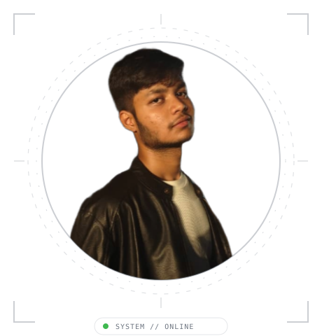
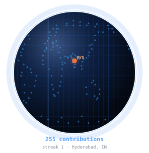

<!-- GITHUB_USERNAME = "Abhinay-code-max" -->
<div align="center">


<br/><br/>

<table>
  <tr>
    <td align="center" valign="middle">
      
      <br/><br/>
      <a href="https://github.com/Abhinay-code-max">github</a> &nbsp;·&nbsp;
      <a href="https://leetcode.com/u/abhinaycodemax/">leetcode</a> &nbsp;·&nbsp;
      <a href="https://www.linkedin.com/in/abhinay-kandrika-5239a442a/">linkedin</a> &nbsp;·&nbsp;
      <a href="https://www.instagram.com/abhinay_2207/">instagram</a> &nbsp;·&nbsp;
      <a href="mailto:abhinay2207@gmail.com">email</a>
    </td>
    <td align="center" valign="middle">
      
    </td>
  </tr>
</table>

<br/>


</div>


<div align="center">


</div>


> Full-stack developer & AI systems engineer.<br>
> Transforming complex problems into sharp, high-performance software.

I build fast, test against real workloads, and focus on practical engineering.<br>
Currently working on autonomous AI assistants, interactive web platforms, and<br>
distributed backend architectures.


```Plain Text
┌─ CORE LANGUAGES ────────────────────────────────────────────────────────┐
│  Python · JavaScript · TypeScript · HTML5 · CSS3 · SQL                  │
├─ AI & BACKEND ──────────────────────────────────────────────────────────┤
│  FastAPI · Node.js · REST APIs · Docker · Linux · WebSockets            │
├─ FRONTEND & INTERACTIVE ────────────────────────────────────────────────┤
│  React.js · Three.js · HTML5 Canvas · Tailwind CSS · Modern Web APIs   │
├─ TOOLS & PLATFORMS ─────────────────────────────────────────────────────┤
│  Git · GitHub Actions · Postman · VS Code · Linux Shell                 │
└─────────────────────────────────────────────────────────────────────────┘
```


**[JARVIS-FOR-WEBSITE](https://github.com/Abhinay-code-max/JARVIS-FOR-WEBISTE)** &nbsp;·&nbsp; <samp>python, ai</samp><br>
Intelligent voice and text assistant for web environments and task automation.

**[eyv-website-2](https://github.com/Abhinay-code-max/eyv-website-2)** &nbsp;·&nbsp; <samp>javascript, react</samp><br>
Modern responsive web platform and frontend architecture.

**[backend-assignment](https://github.com/Abhinay-code-max/backend-assignment)** &nbsp;·&nbsp; <samp>python, backend</samp><br>
Scalable API architecture, data validation, and backend microservices.

**[pac-man-game-](https://github.com/Abhinay-code-max/pac-man-game-)** &nbsp;·&nbsp; <samp>javascript, canvas</samp><br>
Interactive retro arcade game built with vanilla web technologies.


<div align="center">


</div>


<!-- ╔══════════════════════════════════════════════════════════════╗
     ║            STATS DASHBOARD — external live services         ║
     ║  To adapt for your own profile, replace every occurrence of ║
     ║  "Abhinay-code-max" with your GitHub username.              ║
     ╚══════════════════════════════════════════════════════════════╝ -->

<!-- GITHUB_USERNAME = "Abhinay-code-max" -->

<div align="center">

<!-- ── 1. CONTRIBUTION HEATMAP (centerpiece) ──────────────────── -->
<!-- Service: ghchart.rshah.org — no auth, pure SVG, years of uptime -->


<br/>

<!-- ── 2. STREAK + STATS side by side ────────────────────────── -->
<!-- Services: streak-stats.demolab.com + github-profile-summary-cards -->

<table>
  <tr>
    <td align="center">
      
    </td>
    <td align="center">
      
    </td>
  </tr>
</table>

<br/>

<!-- ── 3. COMMIT TIMELINE bar chart (full width) ─────────────── -->


<!-- ── 4. THREE DEEP-DIVE CARDS ──────────────────────────────── -->

<table>
  <tr>
    <td align="center">
      
    </td>
    <td align="center">
      
    </td>
    <td align="center">
      
    </td>
  </tr>
</table>

</div>


<!-- GITHUB_USERNAME = "Abhinay-code-max" -->
<!-- Generated by .github/workflows/snake.yml every 24 h → output branch -->

<div align="center">

<picture>
  <source
    media="(prefers-color-scheme: dark)"
    srcset="https://raw.githubusercontent.com/Abhinay-code-max/Abhinay-code-max/output/github-contribution-grid-snake-dark.svg"
  />
  <source
    media="(prefers-color-scheme: light)"
    srcset="https://raw.githubusercontent.com/Abhinay-code-max/Abhinay-code-max/output/github-contribution-grid-snake.svg"
  />
  
</picture>

</div>


<div align="center">


</div>


Every graphic here is generated, not embedded from anyone else's server.<br>
The stat graphics, activity feed, terminal HUD, LeetCode card, and section headings<br>
are drawn directly by [a scheduled action](.github/workflows/stats.yml)<br>
straight from the GitHub GraphQL & REST APIs and LeetCode GraphQL API, once a day.

They animate with SMIL inside the SVG, because GitHub strips scripts from<br>
READMEs — and since nothing loads from a third party, nothing here can<br>
rate-limit or go dark. The headings are SVGs for the same reason: GitHub also<br>
strips CSS, so an image is the only way to put this page's own typeface on them.

The typeface is [JetBrains Mono](scripts/fonts), subset to just the characters<br>
each graphic draws and inlined as base64.
